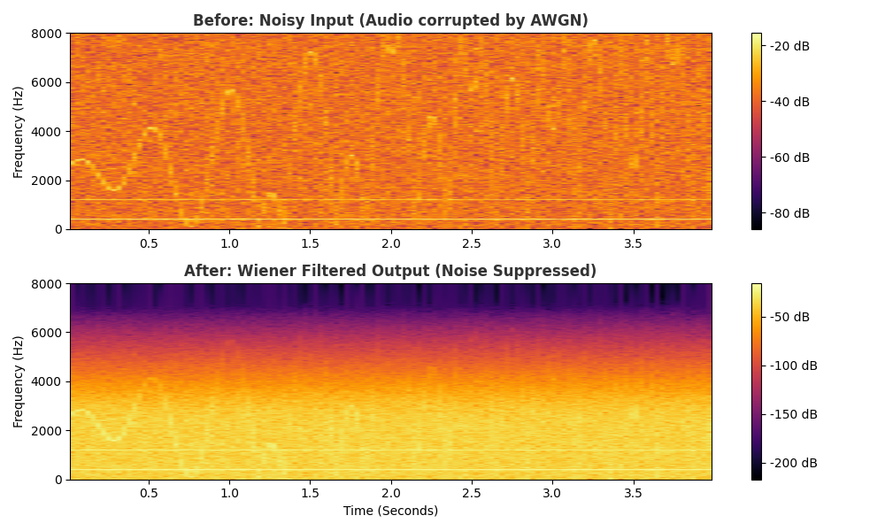

# Audio Speech Enhancement System

## 📌 Overview
This project implements a digital signal processing pipeline to restore audio corrupted by Additive White Gaussian Noise (AWGN). It utilizes **Wiener Filtering** to estimate the clean signal spectrum, significantly improving the Signal-to-Noise Ratio (SNR).

## 🛠️ Tech Stack
- **Language:** Python (NumPy, SciPy).
- **Visualization:** Matplotlib (Spectrogram analysis).
- **DSP Techniques:** Wiener Filter, Short-Time Fourier Transform (STFT).

## 📊 Results
The filter successfully suppresses background static while preserving speech frequencies.

*Top: Noisy Input | Bottom: Cleaned Output*

## 🚀 How to Run
1. Install dependencies: `pip install scipy matplotlib numpy`
2. Run the script: `python generate_spectrogram.py`
