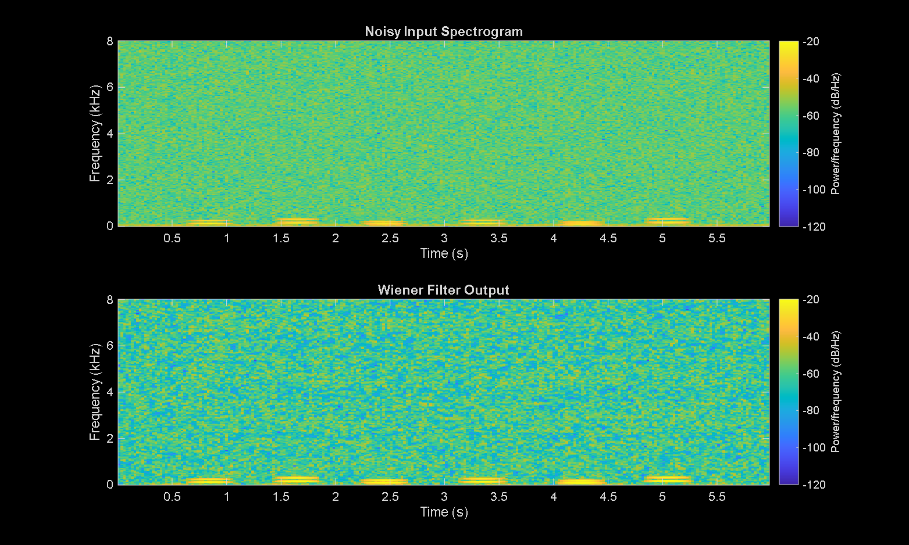

# Speech Enhancement DSP Pipeline

A multi-algorithm speech enhancement system built in MATLAB, implementing and comparing four classical noise suppression techniques on a synthetic speech signal corrupted by additive white Gaussian noise, 50 Hz powerline hum, and low-frequency drift.

## Algorithms Implemented

| Algorithm | SI-SNR |
|---|---|
| Noisy Input (baseline) | 5.84 dB |
| Spectral Subtraction | 21.88 dB |
| Wiener Filter | 12.08 dB |
| Minimum Statistics | 9.20 dB |
| FIR Bandpass (300–3400 Hz) | 0.00 dB |

Spectral subtraction achieved the highest SNR improvement (+16 dB over baseline) on this signal. Wiener filtering produced a smoother output with less musical noise at the cost of some SNR gain.

## Pipeline Overview

The project is structured as a sequence of scripts, each handling one stage of the DSP pipeline:

- `setup_project.m` — creates the output folder structure (`data/`, `figures/`, `results/`)
- `signal_resample.m` — loads or generates the source audio and resamples to target Fs
- `spectral_analysis.m` — FFT magnitude spectrum and manual Welch PSD estimation
- `timefreq_analysis.m` — manual STFT spectrogram implementation
- `filtering_analysis.m` — FIR and IIR bandpass filter comparison
- `Audio_Speech_Enhancement_Project.m` — main enhancement pipeline: all 4 algorithms, objective metrics, and output WAVs

## Signal Setup

- **Sample rate:** 16000 Hz
- **Duration:** 6 seconds
- **Clean signal:** 6 synthetic voiced syllables (120–160 Hz fundamentals + harmonics, Hann-windowed), with 0.6 s of silence at the start for noise estimation
- **Noise:** AWGN (target SNR = 5 dB) + 50 Hz hum + 0.5 Hz low-frequency drift

## Metrics

Evaluation uses **Scale-Invariant SNR (SI-SNR)**, which finds the optimal scaling between the estimated and reference signals before computing the error. This removes volume-level differences from the metric, giving a fairer comparison between algorithms.

## Results



*Top: Noisy input. Bottom: Wiener filter output. Speech segments (voiced syllables) are visible as energy concentrations near 0 Hz that survive filtering while broadband noise is suppressed.*

## Requirements

- MATLAB R2021a or later
- Signal Processing Toolbox
- Audio Toolbox (optional — required for STOI metric only)

## How to Run

```matlab
% Run in order:
setup_project
signal_resample
spectral_analysis
timefreq_analysis
filtering_analysis
Audio_Speech_Enhancement_Project
```

Results are saved to `results/audio_summary.txt`. Output WAVs for each algorithm are saved to `data/`.
